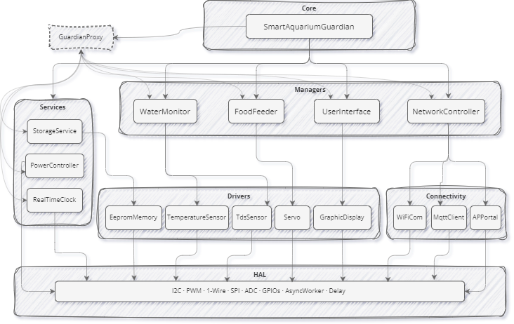

# Smart Aquarium Guardian

Smart Aquarium Guardian is an ESP32-based IoT aquarium monitoring and automation system for hobbyists and small-scale aquariums. It combines real-time sensing, automated feeding, remote telemetry, and a local touchscreen interface to help maintain a healthy aquarium with minimal manual effort.

## Overview

This project monitors key aquarium conditions such as water temperature and TDS, supports scheduled feeding, and publishes telemetry to an MQTT broker such as ThingsBoard. It also provides a local user interface built with LVGL so the device can be controlled directly on the hardware.

The system is designed for users who want to:
- monitor aquarium conditions in real time
- receive alerts when values move outside safe thresholds
- automate feeding routines
- configure and control the device remotely

## Key Features

- Real-time monitoring
  - DS18B20 temperature sensing
  - TDS water quality measurement
  - configurable thresholds and alerts

- Automated feeding
  - servo-based food dispenser
  - up to 10 daily feeding schedules
  - manual feeding support

- Connectivity and telemetry
  - Wi-Fi connectivity with automatic reconnection
  - MQTT-based telemetry and remote control
  - access point mode for initial device configuration

- User interface
  - LVGL-based touchscreen UI
  - live sensor values and status indicators
  - feeding and system controls

- System management
  - RTC-based time synchronization
  - timezone-aware scheduling
  - EEPROM-backed configuration storage
  - battery-aware power handling

## System Architecture

The overall system consists of sensors, a control unit, a local display, and cloud connectivity.


### Main building blocks
- Sensors: temperature, TDS, and power monitoring
- Embedded controller: ESP32 firmware and local logic
- Actuators: servo feeder and display backlight/control
- Connectivity: Wi-Fi, MQTT, and remote configuration
- Cloud backend: optional ThingsBoard telemetry and command handling

## Firmware Architecture

The firmware is organized into logical layers for clarity and maintainability.



### Layered structure
- Core: shared abstractions, lifecycle patterns, and platform interfaces
- Managers: orchestration of system behavior
- Services: domain-specific logic such as storage and power management
- Drivers: hardware abstraction for sensors and actuators
- Connectivity: Wi-Fi, MQTT, and access-point configuration

For more details, see [src/core/README.md](src/core/README.md).

## Hardware Requirements

The current implementation targets an ESP32-based hardware platform and uses the following components:

- ESP32 development board
- DS18B20 temperature sensor
- TDS sensor with analog input
- servo motor for feeding mechanism
- ILI9341 SPI display with touch support
- optional RTC and EEPROM modules
- USB power with battery backup support

## Software Stack

- PlatformIO
- ESP-IDF
- C++17
- LVGL 9.1.0
- MQTT
- nlohmann-json
- Doxygen for API documentation

## Getting Started

### Prerequisites

- PlatformIO
- ESP-IDF 5.1 or newer
- Python 3.8+
- Doxygen

### Clone the Repository

```bash
git clone https://github.com/your-username/SmartAquariumGuardian.git
cd SmartAquariumGuardian
```

### Build the Project

```bash
pio run -e prod
```

### Flash the Firmware

```bash
pio run -e prod -t upload
```

### Monitor Serial Output

```bash
pio device monitor
```

## Configuration

Main configuration values are defined in [include/config.h](include/config.h) and [platformio.ini](platformio.ini).

Common settings you may want to customize:
- GPIO pin assignments
- MQTT broker address and credentials
- telemetry update interval
- sensor thresholds
- feeding schedules

> Security note: avoid committing sensitive credentials to version control. Prefer local configuration files or environment-based secrets for deployment.

## Usage

After flashing the device:

1. power on the ESP32
2. connect to the device configuration access point if prompted
3. configure Wi-Fi credentials
4. connect to the MQTT broker or cloud backend
5. use the local touchscreen UI or remote commands to interact with the system

The device will begin monitoring sensors, publishing telemetry, and executing scheduled feeds automatically.

## Project Structure

- [src](src): application source code
- [include](include): project-wide configuration headers
- [framework](framework): shared hardware and utility abstractions
- [components](components): third-party and project-local components
- [docs](docs): documentation and supporting assets
- [scripts](scripts): helper scripts such as documentation generation

## Documentation

API documentation is generated with Doxygen.

```bash
doxygen Doxyfile
```

The generated documentation is placed under [docs](docs).

## License

This project is licensed under the MIT License. See [LICENSE](LICENSE) for details.
